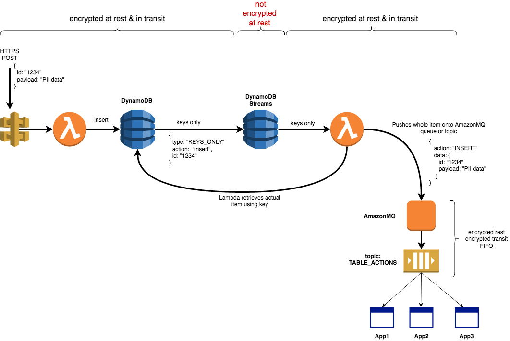

# Dynamo Streams with AmazonMQ 

This is a PoC to show that AmazonMQ linked up to DynamoDB Streams, ensuring that all data sent will be encrypted at rest and in transit





## Getting Started

This poc utilises the serverless framework to deploy the database, stream and lambdas. 

Then there is some manual configuration for the AmazonMQ (as it is not supported in CloudFormation yet)

### Prerequisites

You will need Node installed


### Installing

Install the serverless framework globally

```
npm i -g serverless
```

Now install the packages for the serverless project

```
cd sls-project
npm install
```

## Setup AmazonMQ

Follow these instructions to setup your AmazonMQ broker.

https://docs.aws.amazon.com/amazon-mq/latest/developer-guide/amazon-mq-creating-configuring-broker.html

record the credentials:
```
host, eg. 123abc-1.mq.ap-southeast-2.amazonaws.com
username
password
```

### Store broker credentials in environment vars

The connection creds are required by the lamdbas, and these are read from local env vars prior to deploying to AWS.

Set the following in your terminal:
```
export AMQHOST=<host, eg. 123abc-1.mq.ap-southeast-2.amazonaws.com>
export AMQUSER=<username>
export AMQPASSWORD=<password>
export AMQQUEUE=/sample/test
```

## Deploying the serverless project

```
sls deploy
```

*Note* the endpoint which is displayed at the end of the deployment. You need this to POST some test data later.

```
endpoints:
  POST - https://xyz1234.execute-api.ap-southeast-2.amazonaws.com/dev/add
```

## Setup a receiver 

Open a terminal window and navigate to the *amq_clients*. Ensure that the env vars from above are set in this terminal. Then run node app.

```
export AMQHOST=<host, eg. 123abc-1.mq.ap-southeast-2.amazonaws.com>
export AMQUSER=<username>
export AMQPASSWORD=<password>
export AMQQUEUE=/sample/test

node receive.js
```


## Send data to Dynamo

You now need to make a post to Dynamo, use curl or postman, with the following payload:

```
{
  "id": "123",
  "payload": "some data to store"
}
```

After doing the post, you should see the entry turn up in your receiver terminal.

This data has taken the following path:

1. Data sent via HTTPS to API Gateway using POST
2. API Gateway calls the `post` method in `dynamo.js`
3. This lambda inserts data into DynanoDB
4. DynamoDB puts KEYS_ONLY entry in DynamoDB Streams
5. Streams triggers the `handler` method in `stream.js`
6. This lamdba retrives the item from DynamoDB (not Streams)
7. Connects to AmazonMQ broker, sends item onto queue
8. Receiver (`recieve.js`) is listening on the same queue and outputs the message


## License

This project is licensed under the MIT License - see the [LICENSE.md](LICENSE.md) file for details

## Further reading

This is a very simple proof of concept. To get more details of what AmazonMQ can offer, the following are good starting places:

  * [Amazon MQ landing page](https://aws.amazon.com/amazon-mq/)

  * [AmazonMQ Developer Guide pdf](https://docs.aws.amazon.com/amazon-mq/latest/developer-guide/amazon-mq-dg.pdf)

  * [Apache ActiveMQ cross language clients](http://activemq.apache.org/connectivity.html)


